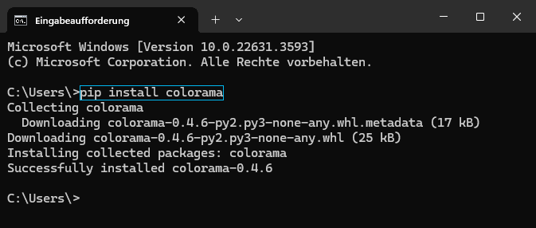

    <h1>Fruit-Hunt</h1>
    
Fruit-Hunt is an exciting 1 vs. 1 game, programmed by Balog and me, LoeweGuckmal. It offers two thrilling versions:

    <ul>
        <li>A version for the Raspberry Pi with a 7-segment display and buzzer.</li>
        <li>A version that can be played on any device with python installed.</li>
    </ul>
    
Dive into the world of Fruit-Hunt and enjoy the fun on your preferred device!

<h1>Troubleshooting Fruit-Hunt</h1>

If you try to start the game and it doesn't work or you receive an error message, please follow the steps below:

<h2>1. Check the error message</h2>

Look at the error message displayed in the terminal or console. It might give you clues about what the problem is. Example:

<h2>2. Install missing dependencies</h2>

Make sure you have all the required Python packages installed. You can install these with <code>pip</code>. Open a terminal or command line and run the following commands:

    <code>pip install pygame</code>

    <code>pip install colorama</code>

Example:

These commands install the necessary libraries <code>pygame</code> and <code>colorama</code>. If you receive other error messages, check if additional libraries are missing and install them accordingly.

The game should now be able to run by double-clicking on the file. Good luck and have fun with the game!

<h2>3. Setting up the Raspberry Pi</h2>

If you want to use the game with a Raspberry Pi, you need to connect the components as shown:

Follow the diagram to properly connect the 7-segment display and buzzer to your Raspberry Pi. Once connected, power on your Raspberry Pi and run the game as usual. Enjoy playing Fruit-Hunt with your Raspberry Pi setup!

